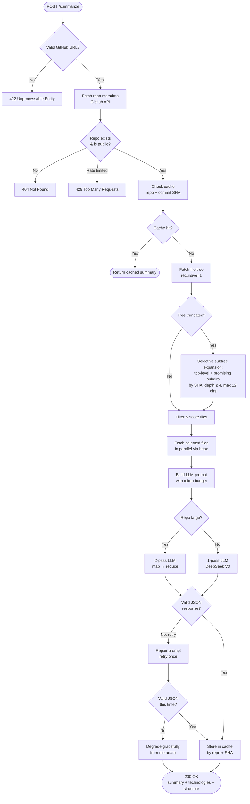
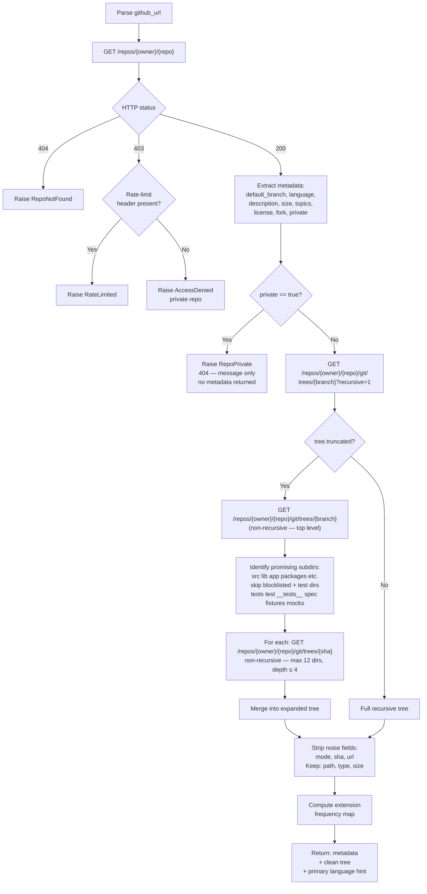
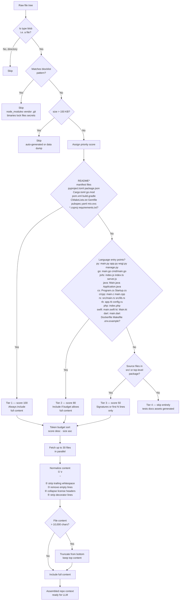
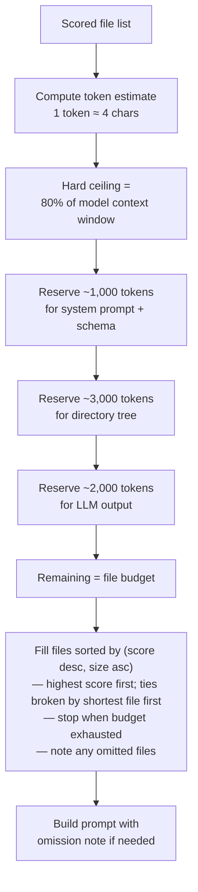
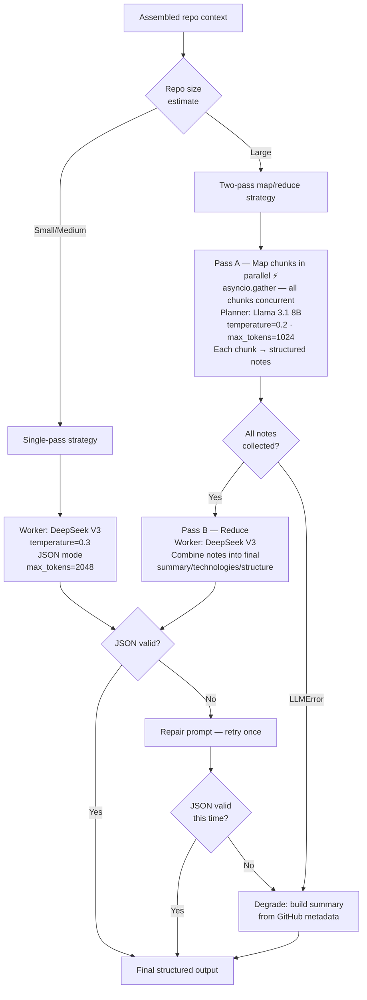
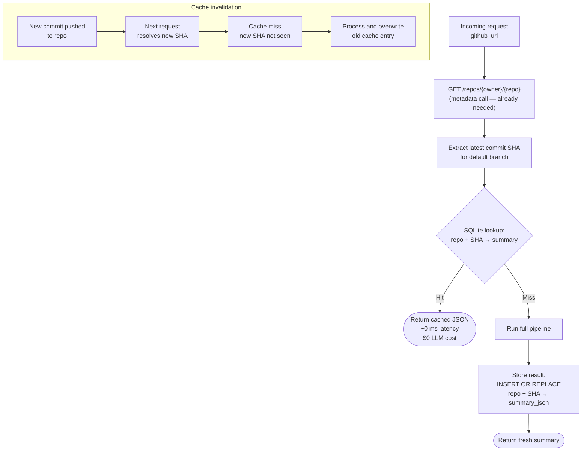
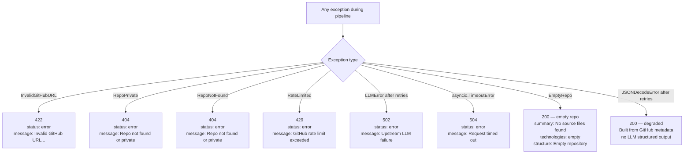

# RepoSummarizer2 — Application Flow

## 1. High-Level Request Flow

The main request lifecycle. Every branch either terminates with an HTTP error or flows through to a `200 OK` response. The cache check (keyed on the exact commit SHA) short-circuits the entire pipeline when the repo hasn't changed since the last request.

## 2. GitHub Data Collection

GitHub is queried with at most 2 + N calls: metadata, recursive tree attempt, and (on truncation fallback) a non-recursive top-level fetch plus up to 12 subtree fetches by SHA. All HTTP I/O is async via `httpx`. A `GITHUB_TOKEN` must be set; unauthenticated requests hit the 60-req/hour cap almost immediately under real load.

## 3. File Filtering & Prioritization

The filtering uses a scoring function rather than ad-hoc conditionals. Higher-scored files fill the token budget first. Truncation always cuts from the bottom — the most informative content in source files is typically at the top (imports, class signatures, docstrings).

## 4. Token Budgeting

## 5. Two-Model LLM Pipeline

The **Planner** (Llama 3.1 8B) is fast and cheap; all map calls are fired concurrently via `asyncio.gather` — wall-clock time is bounded by the slowest single chunk, not the sum. Once all notes are collected, the **Worker** (DeepSeek V3) runs a single reduce pass in JSON mode to produce the final structured response. Both call the Nebius Token Factory API using the same `AsyncOpenAI` client pattern (OpenAI-compatible endpoint).

## 6. Caching Strategy

Cache entries are immortal under the commit SHA key — a given version of a repo never changes. The only invalidation event is a new commit, which produces a new SHA and automatically triggers a miss.

## 7. Error Handling & Response Codes

All errors surface as JSON with `status: "error"` and a human-readable `message`. Private repos raise `RepoPrivate` (a distinct exception from `RepoNotFound`) and return a message-only 404 — no metadata is included to avoid confirming the repo exists or leaking its properties. The only case that silently degrades rather than erroring is a persistent LLM JSON parse failure — returning a partial answer is more useful to the caller than a 502.
