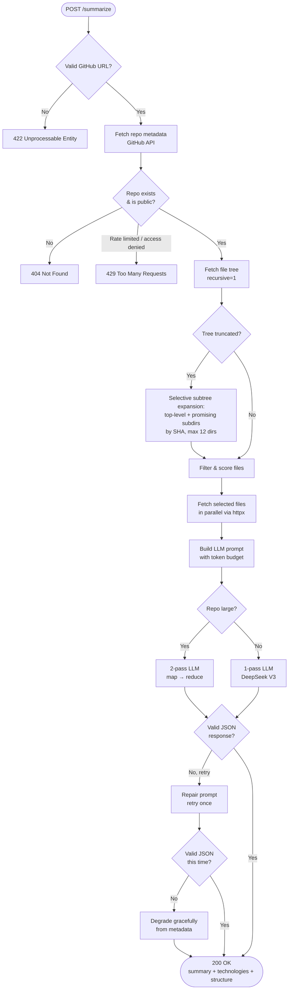
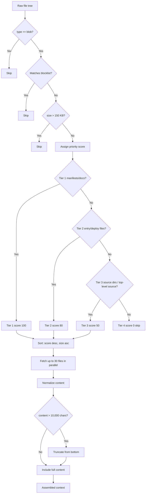
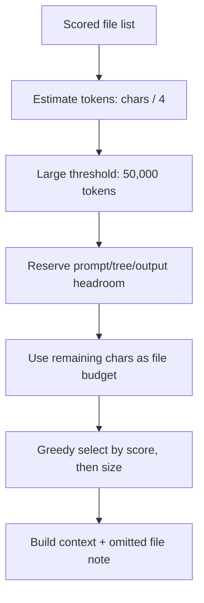
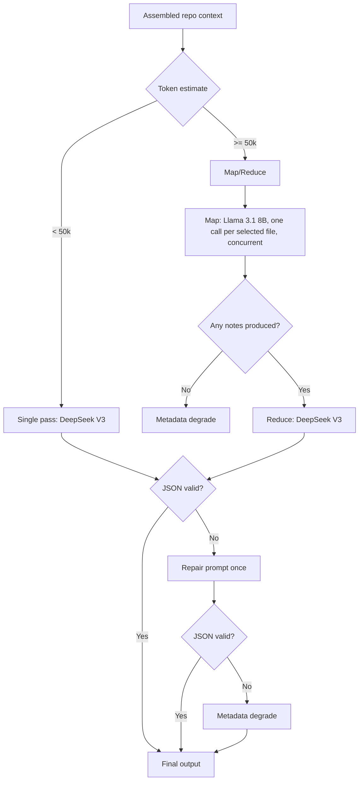

# RepoSummarizer2 — Application Flow (Submission Copy)

This document is a submission-facing copy of the internal flow notes, updated to match the current implementation in `src/`.

## 1. High-Level Request Flow



## 2. GitHub Data Collection

```mermaid
flowchart TD
    A[Parse github_url] --> B[GET /repos/{owner}/{repo}]
    B --> C{HTTP status}
    C -- 404 --> ERR404[Raise RepoNotFound]
    C -- 403 --> ERR429[Raise RateLimited]
    C -- 200 --> E[Extract metadata:<br>default_branch, language,<br>description, topics,<br>license, fork, private]
    E --> F{private == true?}
    F -- Yes --> ERR404_2[Raise RepoPrivate<br>404 message-only]
    F -- No --> G[GET /repos/{owner}/{repo}/git/trees/{branch}?recursive=1]
    G --> H{tree.truncated?}
    H -- Yes --> I[GET /git/trees/{branch}<br>non-recursive top level]
    I --> I2[Pick promising subdirs<br>skip test dirs]
    I2 --> I3[For each: GET /git/trees/{sha}<br>non-recursive, max 12]
    I3 --> J[Merge into expanded tree]
    H -- No --> K[Full recursive tree]
    J --> L[Keep: path, type, size]
    K --> L
    L --> N[Return metadata + cleaned tree]
```

Notes:
- `GITHUB_TOKEN` is optional (recommended for better rate limits), not required to start.
- `MAX_TREE_DEPTH` exists in config but is not currently enforced in the subtree expansion path.

## 3. File Filtering & Prioritization



Note:
- Tier 3 files currently go through the same fetch/normalize/truncate path as other selected files (no dedicated signature-only parser).

## 4. Token Budgeting



## 5. Two-Model LLM Pipeline



Notes:
- In map/reduce mode, `LLMError` is caught and degraded to metadata response (200), not surfaced as 502.
- In single-pass mode, upstream LLM failure maps to 502.

## 6. No-cache runtime mode

For submission simplicity and deterministic behavior during evaluation, this version runs without persistent caching.
Each request executes the same fetch/filter/summarize pipeline end-to-end.

## 7. Errors & Response Shape

- API error payload shape is standardized as:

```json
{ "status": "error", "message": "Description of what went wrong" }
```

- Key mappings:
  - Invalid GitHub URL → 422
  - Invalid request body → 422
  - Repo not found/private → 404
  - GitHub rate limit/access denied path → 429
  - LLM upstream failure (single-pass path) → 502
  - Timeout → 504
  - Empty repo/no source content path → graceful 200 response
